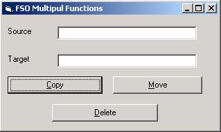



## Copy, Move & Delete Files withinVB Project

### Description

This is code will help to copy, move, delete files within VB Project without using Explorer and just defining the locations of source and target files.

Kindly make reference to Microsoft Scripting Runtime (scrrun.dll).

This code will greatly help in adding Backup and Restore routiens in simple manners.
 
### More Info
 
Source File anem with Location and Target File Name with Location

understading with copy, move & delete file

Message of Function Completion

no side effect at all

             |
---                |---
**Submitted On**   |2001-10-18 12:58:58
**By**             |[Abid Khurshid Butt](https://github.com/Planet-Source-Code/PSCIndex/blob/master/ByAuthor/abid-khurshid-butt.md)
**Level**          |Beginner
**User Rating**    |4.3 (26 globes from 6 users)
**Compatibility**  |VB 6\.0
**Category**       |[Files/ File Controls/ Input/ Output](https://github.com/Planet-Source-Code/PSCIndex/blob/master/ByCategory/files-file-controls-input-output__1-3.md)
**World**          |[Visual Basic](https://github.com/Planet-Source-Code/PSCIndex/blob/master/ByWorld/visual-basic.md)
**Archive File**   |[Copy, Move2963110182001\.zip](https://github.com/Planet-Source-Code/abid-khurshid-butt-copy-move-delete-files-withinvb-project__1-28148/archive/master.zip)

